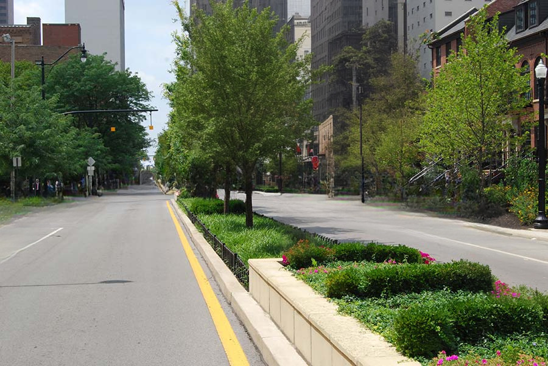

# Lama cleaner as masked content

This extenstion for [AUTOMATIC1111/stable-diffusion-webui](https://github.com/AUTOMATIC1111/stable-diffusion-webui) adds new value of "Masked content" field in img2img -> inpaint tab. It uses preprocessor from controlnet extension, and allows use it with regular inpainting. So this extension requires [Mikubill/sd-webui-controlnet](https://github.com/Mikubill/sd-webui-controlnet)

This option means how to preprocess masked content before pass it into stable diffusion. It useful when you want to remove object in photo. Use inpainting model and denoising straight +-0.4

It also supports my other extension: [sd-webui-replacer](https://github.com/light-and-ray/sd-webui-replacer)

Mask:

lama cleaner:

fill:

Others

original:

latent noise:

latent nothing:

Also you can use Lama cleaner in extras tab, if you want to use it without stable diffusion:

If you have installed this extensions, they appear as models here:
- https://github.com/light-and-ray/sd-webui-resynthesizer-masked-content
- https://github.com/light-and-ray/sd-webui-yandere-inpaint-masked-content
- https://github.com/light-and-ray/sd-webui-manga-inpainting

- \+ inpainting from OpenCV as bonus

## Options

You can adjust few settings:

Go to Settings -> Extras Inpaint:

Default upscaler is `ESRGAN_4x`. But I recommend to use Waifu2x upscaler from [my extension](https://github.com/light-and-ray/sd-webui-waifu2x-upscaler), because it's very fast and good enough for this purpose

Native lama's dataset resolution is 256p, but it shows good result for highers with little quality of content reduction. 512p is optimal

